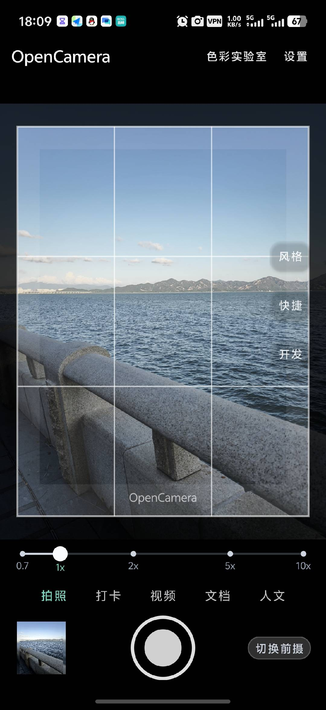
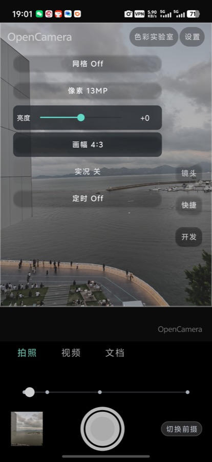
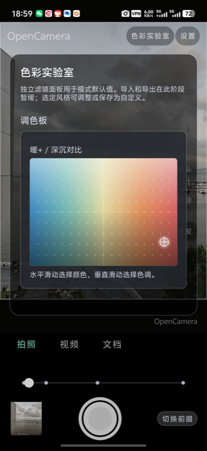
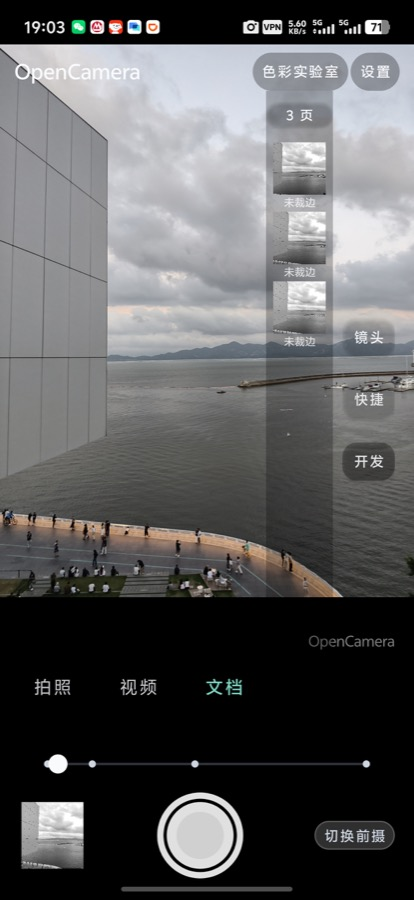
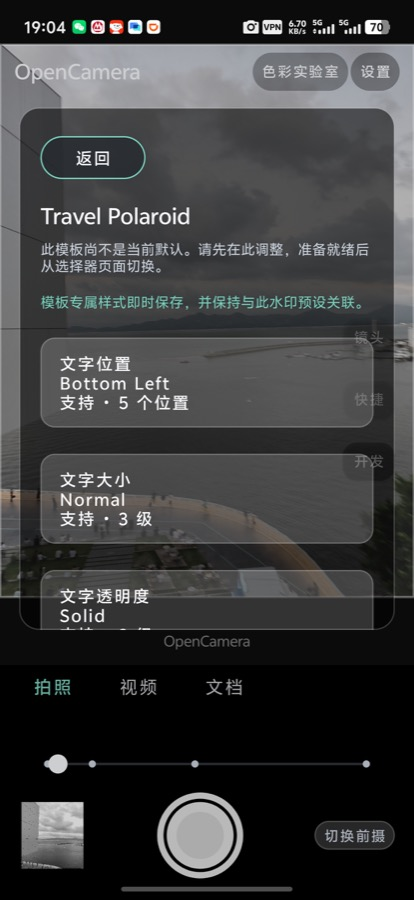
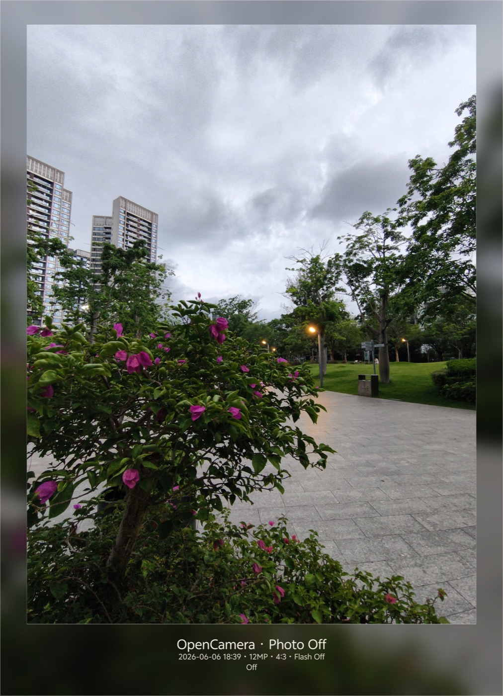

# Teotis Camera

A modern Android camera application with layered architecture design, supporting multiple shooting modes and professional-grade features.

[中文版本](README.md)

## Real-device UI

| Preview | Quick Controls | Color Lab |
|---|---|---|
|  |  |  |

| Document Batch | Watermark Lab | Captured Output |
|---|---|---|
|  |  |  |

## Implementation Highlights

- **State-driven preview UI**: `SessionUiRenderModel` combines session state, settings, capability degradation, and mode metadata into render models. The Activity renders those models and dispatches intents instead of driving camera runtime behavior directly.
- **Independent mode plugins**: Photo, video, document, portrait, night, humanistic, and pro modes declare capture strategy, defaults, and capability requirements through `feature:mode-*` plugins, while the session kernel performs the runtime orchestration.
- **Real-time color pipeline**: Color Lab separates color selection, style configuration, and preview overlay through `ColorLabSpec`, `StyleColorPipeline`, and `PreviewColorTransform`, making live preview and reusable style persistence part of the same flow.
- **Composable media post-processing**: Watermark, aspect ratio, portrait rendering, document crop, and algorithm processors are modeled as media pipeline processors, so preview hints and saved output share the same settings and effect contracts.
- **Document batch model**: Document mode models multi-page capture, crop state, and the thumbnail rail through `DocumentBatch*` state, enabling collection, preview, and later organization of scanned pages.
- **Built-in observability**: The developer panel surfaces diagnostics, recent issues, elapsed time, and link status directly on device, making capture, post-processing, and settings synchronization easier to debug in real scenes.

## Architecture Design

The project adopts a **four-layer architecture + cross-cutting concerns** design pattern:

```
┌─────────────────────────────────────────────────────────┐
│                    UI Layer (app)                        │
│              Render state & dispatch intents             │
├─────────────────────────────────────────────────────────┤
│                 Mode Plugin Layer                        │
│         feature:mode-photo | mode-video | ...            │
│         Describe behavior policies, no direct            │
│              platform API calls                          │
├─────────────────────────────────────────────────────────┤
│                 Session Kernel Layer                      │
│                   core:session                           │
│   Session state | Preview/Capture/Record | Recovery      │
│                    State transitions                     │
├─────────────────────────────────────────────────────────┤
│                Device Adapter Layer                       │
│                   core:device                            │
│    Translate abstract requests to CameraX/Camera2 calls  │
├─────────────────────────────────────────────────────────┤
│                 Media Pipeline Layer                      │
│                   core:media                             │
│        Capture | Post-processing | Algorithm | Save      │
├─────────────────────────────────────────────────────────┤
│              Cross-cutting Concerns                      │
│    stability | recovery | observability | diagnostics    │
└─────────────────────────────────────────────────────────┘
```

### Core Design Principles

1. **Single Responsibility**: UI only handles rendering and intent dispatch, never directly drives camera runtime behavior
2. **State Isolation**: Runtime state and persisted settings are strictly separated
3. **Contract First**: All hardware capabilities must have explicit `supported/unsupported/degraded` semantics
4. **Testability**: Every module has complete unit test coverage

## Feature List

### Shooting Modes

| Module | Feature | Status |
|--------|---------|--------|
| `feature:mode-photo` | Standard photo mode | ✅ |
| `feature:mode-video` | Video recording mode | ✅ |
| `feature:mode-night` | Night mode | ✅ |
| `feature:mode-portrait` | Portrait mode | ✅ |
| `feature:mode-document` | Document scanning mode | ✅ |
| `feature:mode-humanistic` | Humanistic mode | ✅ |
| `feature:mode-pro` | Professional mode | ✅ |

### Core Capabilities

| Module | Responsibility | Key Features |
|--------|---------------|--------------|
| `core:session` | Session kernel | State machine, recovery mechanism, diagnostic tracing |
| `core:device` | Device adapter | Zoom, video, manual parameter modeling |
| `core:media` | Media pipeline | Capture graph, frame ring buffer, watermark archive |
| `core:mode` | Mode catalog | Plugin contracts, frame ratio, still capture graph |
| `core:settings` | Settings persistence | Feature catalog, style/color pipeline |
| `core:capability` | Capability graph | Contract resolution, capability queries |
| `core:effect` | Effect bridge | Render recipe, preview effect adapter |

### Application Features

- **Gesture Control**: Tap to focus, pinch to zoom, slide to adjust
- **Orientation Aware**: Adaptive landscape/portrait UI layouts
- **Cockpit Panel**: Professional parameter adjustment interface
- **Color Lab**: Real-time color style preview
- **Watermark System**: Configurable watermark post-processing pipeline
- **Dev Console**: Runtime diagnostics and log export

## Tech Stack

| Technology | Version | Purpose |
|------------|---------|---------|
| Kotlin | 1.9.24 | Primary language |
| Android SDK | 35 (min 26) | Target platform |
| Gradle | 8.7 | Build system |
| AGP | 8.5.2 | Android build plugin |
| CameraX | 1.3.4 | Camera API abstraction |
| AndroidX | - | Jetpack component library |

## Project Structure

```
teotis-camera/
├── app/                          # Application module
│   └── src/main/java/com/opencamera/app/
│       ├── MainActivity.kt       # Entry Activity
│       ├── CameraSessionCoordinator.kt  # Session coordinator
│       └── ...                   # UI and integration code
├── core/                         # Core library modules
│   ├── session/                  # Session kernel
│   ├── device/                   # Device adapter
│   ├── media/                    # Media pipeline
│   ├── mode/                     # Mode catalog
│   ├── settings/                 # Settings management
│   ├── capability/               # Capability graph
│   └── effect/                   # Effect processing
├── feature/                      # Feature mode plugins
│   ├── mode-photo/
│   ├── mode-video/
│   ├── mode-night/
│   ├── mode-portrait/
│   ├── mode-document/
│   ├── mode-humanistic/
│   └── mode-pro/
├── build.gradle.kts              # Root build config
├── settings.gradle.kts           # Module declarations
└── gradle.properties             # Gradle configuration
```

## Build Guide

### Requirements

- Android Studio Hedgehog (2023.1.1) or higher
- JDK 17
- Android SDK 35

### Build Steps

```bash
# Clone repository
git clone git@github.com:teotis/teotis-camera.git
cd teotis-camera

# Build Debug APK
./gradlew :app:assembleDebug

# Run unit tests
./gradlew :core:session:test
./gradlew :core:device:test
./gradlew :app:testDebugUnitTest
```

### Install to Device

```bash
# Install to connected device
./gradlew :app:installDebug
```

## License

The source code is licensed under the **GNU General Public License v3.0 or later**. See [LICENSE](LICENSE) for details.

This means any copied, modified, or redistributed derivative of the code must keep the corresponding source code open under GPLv3 or compatible terms, and must preserve copyright, license, and attribution notices.

Documentation, screenshots, and visual assets are licensed under the **Creative Commons Attribution-ShareAlike 4.0 International License** unless otherwise noted.

The `Teotis Camera` name, logo, and brand assets are not licensed for trademark or branding use. They may not be used to imply official endorsement or confuse the source of a derivative work without explicit permission.

Attribution details are provided in [NOTICE](NOTICE) and [AUTHORS](AUTHORS).

## Contributing

Issues and Pull Requests are welcome. Please ensure:

1. Follow existing code style
2. Add unit tests for new features
3. Update relevant documentation
