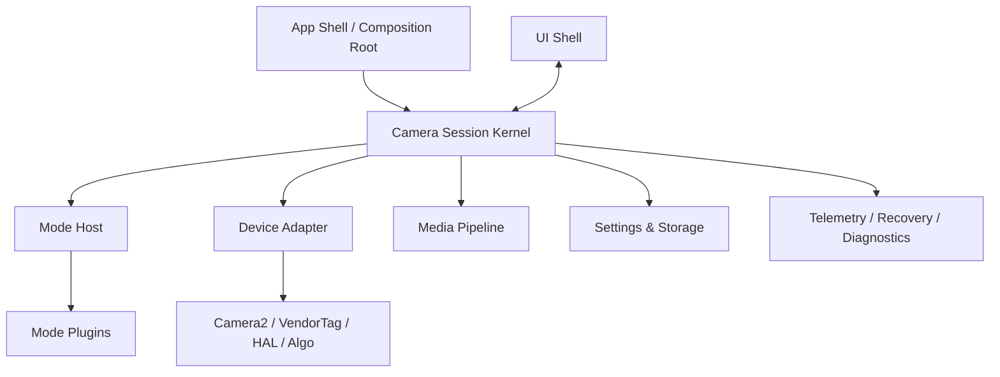

### 总体需求

当前已有一个功能繁多、模式繁多、设备依赖深（仅支持小米手机特定版本）、维护复杂的 Android Camera APP 项目 `MiuiCamera`。  
现在打算从零开始建立一个新的相机工程，支持适配常见安卓机型，项目名为 `OpenCamera`。

`OpenCamera` 不是对旧工程做表面清理，也不是把旧模块重新搬运一遍。  
目标是：

**以新的架构边界，重新建立一个可长期演进、可承载复杂模式、可治理稳定性、可持续维护的 Android Camera APP。**

重构过程中，允许复用旧项目中已验证有效的能力、链路、实现和经验，但必须在**新的架构边界**下吸收，而不是把旧工程耦合关系整体复制过来。

---

### 对这个重构任务的根本理解

相机 App 不是普通 CRUD App。  
它本质上是一个：

- **实时硬件控制系统**
- **多模式插件平台**
- **高并发高状态复杂度系统**
- **强设备差异、强异常恢复要求的工程系统**

真正难的不是“把功能做出来”，而是：

- 把预览、拍照、录像、切模式、切镜头、切前后台、权限中断、异常恢复等复杂链路稳定下来
- 让复杂模式继续叠加时，系统不会越来越脆
- 让问题出现后，能够被观测、定位、复盘，而不是只能猜

因此，本项目重构必须优先解决的是：

1. 会话主链路稳定
2. 状态边界清晰
3. 模式接入边界清晰
4. 设备抽象边界清晰
5. 恢复链路内建
6. 可观测性内建
7. 后续复杂功能可以继续演进，而不是越做越乱

---

### 总原则

不按“旧代码模块”组织新工程，而按“系统性质”设计。

架构中心不应是普通业务 App 常见的 Repository + ViewModel，  
而应是以下五层能力：

1. **Session Kernel**
   - 稳定控制 Camera 生命周期、预览、拍照、录像、切模式、切镜头、恢复
2. **Mode Plugin**
   - 将不同模式的能力挂到会话内核之上
3. **Device Adapter**
   - 将抽象能力翻译到 Camera2 / HAL / VendorTag / 算法能力
4. **Media Pipeline**
   - 统一拍摄结果、缩略图、保存、后处理入口
5. **Telemetry / Recovery**
   - 记录状态轨迹，支撑恢复、诊断、稳定性治理

UI 只做渲染和意图分发，不直接碰底层设备细节。

---

### 重构时必须长期坚持的原则

- **先内核，后模式**
- **先主路径，后复杂 feature**
- **先能力边界，后旧功能迁移**
- **先验证闭环，后扩展范围**
- **先可恢复、可观测，后追求功能规模**
- **先建立清晰依赖方向，后做局部性能与体验优化**

---

### 建议架构



### 架构中心：Session Kernel

整套系统围绕一次 `CameraSession` 运转，而不是围绕全局单例运转。

建议核心接口形态：

```
interface CameraSession {
    val state: StateFlow<SessionState>
    suspend fun dispatch(intent: SessionIntent)
    fun currentMode(): ModeController
}
```

关键原则：

- 所有“当前相机运行状态”都属于 `SessionScope`

- 只有 `Session Kernel` 能修改会话状态

- UI、模式、算法都只能发 intent / command

- Kernel 统一更新状态，再触发副作用

- 打开失败、provider death、surface 丢失、session 重建等异常，都由 Kernel 统一接管

- Session Kernel 是唯一运行时主调度中心。

  不允许在 Kernel 之外，再演化出第二个拥有以下职责组合的隐式内核：

  - 解释 session state
  - 消费 device / adapter 事件
  - 回灌新的 session intent
  - 编排 recovery / rebind / refresh / attach / detach 等时序动作

  Coordinator / Manager / Mediator / Bridge 只允许承担装配、桥接、转发、隔离边界等职责，不得拥有独立运行态主导权。

------

### 状态分层原则

必须把不同生命周期的状态拆开，不能混成一个大仓库。

建议至少区分：

- `AppState`
  - 进程级只读信息、全局 feature flag、设备画像、能力缓存、全局依赖
- `SessionState`
  - 当前 cameraId、当前 mode、preview / capture / recording 状态、surface 状态、错误态、恢复态
- `ModeState`
  - 当前模式特有状态，如夜景阶段、人像状态、Live 状态等
- `UiState`
  - 当前面板展开、按钮状态、提示文案、loading、toast / dialog 可见状态
- `PersistedSettings`
  - 用户持久化设置，按全局 / 镜头 / 模式拆分
- `SessionEphemeralState`
  - 只属于当前 session、不可持久化、退出即失效的瞬时态

关键要求：

- 运行时状态与持久化设置必须分离
- 不要把“当前状态”和“持久化设置”塞进一个巨大的仓库
- `StateFlow` 只承载中低频状态，不承载高频帧数据、图像流、预览 metadata
- 高频数据流必须走独立 pipeline / callback / channel

状态所有权原则：

除派生展示态外，任何一类运行时状态都必须有唯一 owner。  
同一语义状态不得在 App Shell、Session、Mode、DeviceAdapter、UI 层被重复持有、重复解释、重复驱动。

允许：

- 从单一真实状态派生只读快照、显示文案、诊断信息

不允许：

- 为了编排方便，在其他层再维护同语义的影子状态
- 多层同时维护“当前是否恢复中 / 当前预览是否附着 / 当前设备能力是否可用 / 当前拍摄结果摘要”等同类运行态

------


### App Shell / UI 边界补充约束

App Shell 只负责：
- 依赖装配
- 生命周期信号接入
- UI 渲染
- 用户输入分发

App Shell 不负责：
- 维护 session 外的影子状态机
- 私自编排 boot / preview attach / preview detach / recovery / rebind 顺序
- 直接驱动相机运行时流程
- 在权限、生命周期、surface 变化后绕开 session 做旁路控制

权限变化、生命周期变化、surface 变化等外部事件，必须先转为 session 可消费的 intent / signal，再由 kernel 统一决策。


### 界面 / UI 效果决策补充规则

界面设计、UI 效果和视觉交互细节，默认应先基于当前任务目标、模式语义、设备约束、可实现性和整体一致性，自行分析最合适的处理方式，不机械套用单一参考机。

若当前信息不足，或在多个可行方案之间无法确定最佳处理，则参考优先级固定为：

1. 优先参考 `vivo X300 Ultra`
2. 次优参考 `iPhone 17 Pro Max`

参考上述机型时，应吸收其产品表达、层级组织、动效节奏和拍摄场景适配思路，但仍需服从本项目既有架构边界、Android 平台约束和当前模式语义，避免为了贴近参考而引入不合理实现。


### 模式插件边界

模式不应继承一个巨大的 `BaseModule` 再覆盖几百个方法。
 模式应以**小契约**接入内核。

建议形态：

```
interface CameraModePlugin {
    val id: ModeId
    fun isSupported(caps: DeviceCaps): Boolean
    fun create(context: ModeContext): ModeController
}

interface ModeController {
    val state: StateFlow<ModeState>
    fun uiSpec(): ModeUiSpec
    fun capturePolicy(): CapturePolicy
    suspend fun onEnter()
    suspend fun onExit()
    suspend fun handle(intent: ModeIntent)
}
```

每个模式只负责贡献：

- `ModeUiSpec`
- `CapturePolicy`
- `PreviewSpec`
- `PostProcessContributors`
- `ModeStateReducer`
- `DegradeHints`

关键原则：

- 模式只描述“我要什么”
- 模式不直接操作 Camera2 / HAL / VendorTag
- 模式不直接接管恢复逻辑
- 模式不持有全局耦合状态
- 新增模式时，不应破坏 `SessionKernel` 主流程

Mode 状态边界补充约束：

Mode Plugin 只持有模式特有状态，不重复持有共性会话态、设备态、能力态、媒体态。

以下信息若属于跨模式共性上下文，应由 Session / Device 层提供，而不是在各模式内部重复缓存和解释：
- device capabilities
- lens facing
- quality / resolution 选择结果
- preview graph / capture graph 摘要
- recovery / permission / surface 等公共运行态

Mode 契约优先采用声明式输入、派生只读快照和稳定小接口，避免通过大量 imperative callback 将外部状态灌入 controller，导致 controller 退化为微型 ViewModel。

------


### 设备层边界

不允许业务代码直接散落调用 Camera2 细节。
 设备层应负责把抽象意图翻译成具体设备行为。

建议拆分：

- `DeviceCaps`
- `CaptureRequestSpec`
- `StreamGraph`
- `StreamGraphPlanner`
- `RequestTranslator`
- `DegradePolicy`
- `VendorTagFacade`
- `DeviceAdapter`

关键原则：

- 模式描述能力需求
- 设备层负责能力协商与降级
- 内核负责调度与收敛
- 模式不复制 Camera2 细节
- 不要用一个新的“大而全适配器”替代旧的“大而全基类”

------

### Media Pipeline 原则

拍照、录像抓拍、缩略图、保存、后处理入口、EXIF、水印等能力，最终应进入统一媒体管线，而不是继续散落在各模式中。

这条线的目标是：

- 模式声明拍摄策略
- 统一执行拍摄结果处理
- 统一生成缩略图与保存任务
- 为 EXIF / 水印 / 后处理 / 算法入口预留清晰挂点
- 逐步形成统一 `Shot / Media Pipeline`

------

### 线程模型必须先固定

相机 App 极易死在并发与时序问题上，因此线程边界必须是架构的一部分。

建议线程模型：

- `Main Thread`
  - UI 展示、输入采集
- `Session Actor`
  - 串行处理会话命令，维护会话状态一致性
- `Device Thread`
  - Camera 打开、请求提交、回调接收
- `Media Pipeline Pool`
  - 编码、解码、保存
- `Algo Pool`
  - 算法、AI、后处理
- `IO / Persistence Thread`
  - 设置持久化、trace 落盘、日志输出

关键规则：

- `SessionState` 只能由 `Session Actor` 修改
- UI 层不允许直接改相机运行态
- 模式插件不允许直接调 Camera2
- 恢复流程也必须走 Session 串行命令
- 高频数据与低频状态必须分流

------

### 故障恢复模型必须内建

重构不能只关注正常链路，必须把异常链路当成正式架构能力。

至少应明确：

- `RecoveryState`
- `FailureReason`
- `RecoveryPolicy`
- `ReopenStrategy`
- `SessionGuard`
- `Retry Budget / Fallback Budget`

关键原则：

- 恢复逻辑只能由 `Kernel` 统一发起
- 恢复必须是显式状态，不是 scattered try-catch
- 模式插件不能私自 reopen
- 所有恢复动作必须可观测、可追踪、可统计

------

### 可观测性必须是正式能力

重构后必须内建 session 级观测能力，否则系统复杂度上来后问题仍然难查。

建议建设：

- `SessionTrace`
- `TransitionTrace`
- `DegradeTrace`
- `RecoveryTrace`
- `PerfSnapshot`
- `DebugDump`

关键原则：

- trace 不是临时调试日志，而是正式架构能力
- 关键路径必须统一埋点格式
- 问题定位应能回放 session 状态，而不是靠猜
- 稳定性治理、性能治理、问题复盘，使用同一套观测模型

------

### 重构时应优先避免的失败路线

严禁把新工程重构成以下任一种形态：

- 一个巨大的 `Camera Activity`
- 一个巨大的 `BaseModule`
- 一个无所不包的 `DataRepository`
- 全局协议总线 / 全局静态注册表
- UI 直接操作 Camera2 / 算法对象
- 模式之间互相直接依赖
- 把恢复逻辑散落在各处私自处理
- 把高频图像事件塞进统一状态仓库
- 把旧工程耦合关系整体平移到新工程
- 用新名字包装旧结构，而非真正重建边界

------

### 对“复用旧工程代码”的正确理解

允许复用 `MiuiCamera` 中：

- 已经在真实设备上被长期验证的链路
- 已经证明有效的底层实现
- 已有经验价值的状态划分、能力判断、容错逻辑
- 已经有实际产出价值的保存、缩略图、EXIF、设备能力相关实现

但复用时必须满足：

- 先识别它属于新架构的哪一层
- 先建立清晰边界后再接入
- 不得直接把旧工程的大类、全局状态、耦合调用整体迁入
- 不得为了图快，破坏新工程架构方向

**复用旧代码是为了降低重构成本，不是为了复制旧结构。**

------

### 执行优先级

在具体实现中，默认优先级应为：

1. 当前阶段主路径成立
2. 当前阶段关键验证可跑通
3. 影响主路径稳定性的问题
4. 影响阶段完成度的结构问题
5. 为后续阶段建立必要边界
6. 当前阶段内必要的局部补齐
7. 低收益清理、命名优化、展示型重构

------

### 最终目标

重构成功后的 `OpenCamera`，至少应满足以下方向：

- 新增一个模式，只新增一个 feature mode 模块和注册项，不改 `SessionKernel` 主流程
- 新增一个机型适配，只补 `DeviceCaps / Translator / DegradePolicy` 等设备层实现，不改模式业务
- UI 改版，只改 `UiSpec renderer`，不改拍摄内核
- 任意一次故障，都能从 session trace 还原，而不是靠猜全局状态
- 复杂模式、复杂 feature、稳定性治理，都能沿现有边界继续演进，而不是每加一项都回到全局耦合
